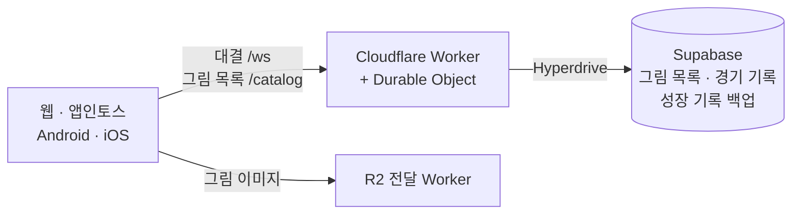

# 틀린그림 갤러리 (Spot Difference Battle)

> 문서 상태: CURRENT · 기준일 2026-10-01 · 게임 규칙의 정본은 [`docs/GAME_RULES.md`](docs/GAME_RULES.md)

같은 그림 두 장에서 다른 곳을 찾는 게임입니다. 하나의 웹 코드로 **웹 · 앱인토스 · Android · iOS**를 만듭니다.

## 게임 소개

| 모드 | 내용 |
|---|---|
| **1대1 대결** | 두 사람이 같은 순서의 그림 10점을 동시에 풉니다. 차이 3개를 찾으면 다음 그림으로 넘어가고, 전체를 먼저 끝낸 사람이 바로 이깁니다. |
| **혼자 하기** | 어려운 차이 5개를 찾는 타임어택입니다. 서버가 잰 기록으로 그림별 이번 주·전체 랭킹을 겨루고, 주간 상위권은 코인과 칭호를 받습니다. |
| **성장** | 레벨·코인·꾸미기·수집("내 갤러리")·오늘의 목표. 보상은 항상 서버가 계산합니다. |

## 빠른 시작

필요한 것: **Node.js 24+**, **pnpm 11.9.0**

```bash
pnpm setup   # 의존성 설치 + 공유 패키지 빌드
pnpm dev     # 웹(5173) + 개발 서버(3001) 실행
```

`http://localhost:5173`을 브라우저 두 개(또는 시크릿 창)로 열면 혼자서 대결을 시험할 수 있습니다.
DB 없이 메모리 저장소로 동작하며, 개발 서버 설정은 `.env.example`에 있습니다. PostgreSQL은 DB 테스트를 돌릴 때만 필요합니다(`docker compose up postgres`).

<details>
<summary>같은 Wi-Fi의 휴대폰으로 시험하기</summary>

1. PC와 휴대폰을 같은 Wi-Fi에 연결합니다.
2. PC에서 `ipconfig`로 IPv4 주소를 확인합니다.
3. `pnpm dev` 실행 후 휴대폰에서 `http://<PC IPv4>:5173`에 접속합니다.

개발 웹은 접속한 PC의 3001 포트 서버에 자동으로 연결합니다. 사설망 테스트 전용입니다.

</details>

## 자주 쓰는 명령

| 명령 | 하는 일 |
|---|---|
| `pnpm dev` | 로컬 개발 실행 |
| `pnpm check` | 구조·타입 검사 |
| `pnpm test` | 단위·통합 테스트 |
| `pnpm e2e` / `pnpm e2e:cloudflare` | 브라우저 테스트(개발 서버 / 로컬 Worker) |
| `pnpm build:ait:cloudflare` | 토스(앱인토스)에 올릴 번들 |
| `pnpm build:android` / `pnpm build:ios` | Android·iOS 앱에 웹 번들 넣기 |
| `pnpm puzzle publish <폴더> --upload --activate` | 새 그림을 R2·DB에 올려 바로 게임에 노출 |

앱·앱인토스 번들이 접속하는 운영 서버 주소는 `scripts/production.config.json` 한 곳에서 바꿉니다.

## 구조



- **운영 서버는 Cloudflare Worker 하나**입니다. main에 머지하면 자동으로 다시 배포됩니다.
- `apps/server`(Node)는 **로컬 개발·자동 테스트 전용**이며 운영에 배포하지 않습니다.

```text
apps/
  web/          React·Vite 게임(모든 플랫폼 공용)
  server/       로컬 개발 서버 + Worker와 공유하는 카탈로그·저장소 코드
  android/      Android WebView 래퍼
  ios/          iOS 앱(Capacitor)
workers/
  realtime/     운영 게임 Worker
  r2-delivery/  그림 이미지 전달 Worker
packages/
  shared/       공유 규칙·타입·통신 계약
  game-core/    대결 판정 엔진
supabase/       DB 마이그레이션
scripts/        빌드 · 그림 등록 도구 · 구조 검사
tests/e2e/      Playwright 브라우저 테스트
docs/           명세 · 설계 · 운영 문서(history/는 과거 기록)
```

## 문서

| 분류 | 문서 |
|---|---|
| 규칙·기획 | [게임 규칙](docs/GAME_RULES.md) · [모드](docs/GAME_MODES.md) · [기획](docs/GAME_DESIGN.md) · [결정 기록](docs/MVP_DECISIONS.md) |
| 화면 | [사용자 흐름](docs/USER_FLOW.md) · [화면 명세](docs/SCREEN_SPEC.md) · [UI 구현 기준](docs/design/UI_GUIDELINES.md) |
| 기술 | [기술 설계](docs/TECH_SPEC.md) · [게임 상태](docs/GAME_STATE.md) · [DB 설계](docs/DATABASE_DESIGN.md) · [저장소 구조](docs/REPOSITORY_STRUCTURE.md) |
| 운영 | [Cloudflare 배포](docs/CLOUDFLARE_DEPLOYMENT.md) · [그림 등록](docs/GAME_ASSETS.md) · [모바일 앱](docs/MOBILE_APPS.md) · [Android 빌드 환경](docs/android-build-environment.md) |
| 품질·계획 | [테스트 계획](docs/TEST_PLAN.md) · [테스트 구조](docs/TEST_STRUCTURE.md) · [백로그](docs/IMPLEMENTATION_BACKLOG.md) · [문서 운영 기준](docs/DOCUMENTATION.md) |
