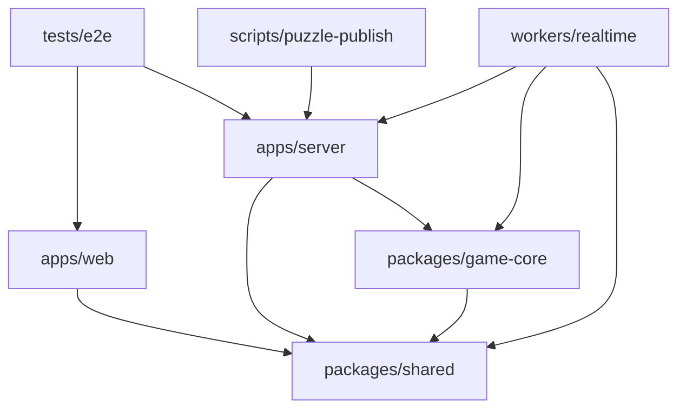

# 저장소 구조

> 문서 상태: CURRENT
> 기준일: 2026-10-01

실행 가능한 앱·Worker, 재사용 패키지, 시스템 테스트, 문서를 최상위 경계로 나눈다. 앱과 Worker는 공유 계약과 순수 게임 코어에 의존하며, 패키지는 앱을 역참조하지 않는다.

## 디렉터리

- `apps/`
  - `web/`: React·Vite 클라이언트(웹·앱인토스·Android 공용)
    - `src/app/`: 앱 조합과 최상위 화면
    - `src/config/`: 서버 주소 등 런타임 환경 해석
    - `src/features/catalog/`: 서버 그림 목록(`/catalog`) 읽기·사전 로드
    - `src/features/game/`: 대결 보드, 통신 훅, 화면 모델, 번들 대결 그림
    - `src/features/solo/`: 솔로 엔진·화면·번들 솔로 그림
    - `src/features/gallery/`: 갤러리 화면(전시, 성장, 꾸미기, 내 갤러리)
    - `src/assets/puzzles/`: 번들 그림(WebP), `solo/`는 솔로 전용
    - `src/assets/cursors/`: 포인터 SVG
    - `src/styles/`: 전역 스타일, 갤러리 디자인 시스템(`gallery.css`)
  - `server/`: 로컬 개발용 Fastify·Socket.IO 서버. `src/game/`(카탈로그)·`src/persistence/`(Supabase 저장소)는 운영 Worker도 가져다 쓴다.
    - `test/unit/`, `test/integration/`
  - `android/`: Android WebView 래퍼(Gradle)
- `workers/`
  - `realtime/`: 운영 게임 Worker(Durable Object `GameLobby`, 정적 웹, `/ws`, `/catalog`, `/health`)
  - `r2-delivery/`: R2 이미지 전달 Worker
- `packages/`
  - `shared/`: 게임 설정, 공유 타입, 통신 계약, 그림 매니페스트·카탈로그 타입, 성장·꾸미기 규칙
  - `game-core/`: 좌표 판정·점수·경기 상태 머신(`test/` 포함)
- `supabase/migrations/`: DB 스키마
- `scripts/`: 빌드(`build-cloudflare.mjs`, `copy-android-web.mjs`), 그림 등록(`puzzle-publish.mjs`), 구조 검사
- `tests/e2e/`: 웹과 서버를 함께 실행하는 Playwright 시스템 테스트
- `docs/`: 현재 명세(`design/` 포함)와 `history/`(과거 기록)

## 의존 방향

허용되는 방향은 위 화살표뿐이다. `packages/`에서 `apps/`를 import하거나 `game-core` 내부 모듈이 배럴 파일 `index.ts`를 역참조하면 안 된다. `workers/realtime`은 `apps/server`의 카탈로그·저장소 모듈만 가져다 쓴다.

## 배치 원칙

| 변경 대상 | 위치 | 이유 |
|---|---|---|
| 웹 화면·상태 훅 | `apps/web/src/features/<기능>/` | 기능 단위로 변경 범위를 모은다 |
| 번들 그림 | `apps/web/src/assets/puzzles/` | 빌드 입력만 실행 앱 가까이에 둔다 |
| 새 그림 | R2 + `puzzle_catalog` | 코드·재배포 없이 추가한다(`GAME_ASSETS.md`) |
| 저장 구현 | `apps/server/src/persistence/` | 게임 규칙과 인프라를 분리하고 Worker와 공유한다 |
| 공유 네트워크 계약 | `packages/shared/src/protocol/` | 웹·서버 타입 불일치를 막는다 |
| 순수 판정·보상 규칙 | `packages/game-core/src/`, `packages/shared/src/game/` | 프레임워크 없이 단위 테스트한다 |
| DB 변경 | `supabase/migrations/` | Supabase CLI로만 적용한다 |
| 패키지 테스트 | 각 패키지의 `test/` 또는 구현 옆 `*.test.ts` | 패키지가 독립적으로 검사된다 |
| 앱 전체 브라우저 테스트 | `tests/e2e/` | 어느 한 패키지에도 속하지 않는 시스템 검증이다 |
| 과거 기록 | `docs/history/` | 현재 명세와 검색 결과가 섞이지 않게 한다 |
| 생성된 `*.ait` | GitHub Actions artifact | 재생성 가능한 바이너리를 소스에 넣지 않는다 |

## 구조 검사

`pnpm check`는 타입 검사 전에 `scripts/check-repository-structure.mjs`를 실행한다. 예전 `UI/`, 최상위 `e2e/`, 임시 payload, 서버 `src` 내부 테스트, 생성된 `*.ait`가 다시 들어오면 실패한다. 테스트 배치의 상세 결정은 [테스트 구조](TEST_STRUCTURE.md)를 따른다.
